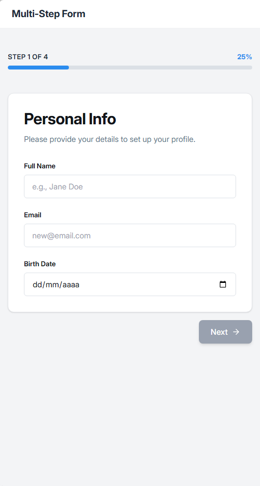
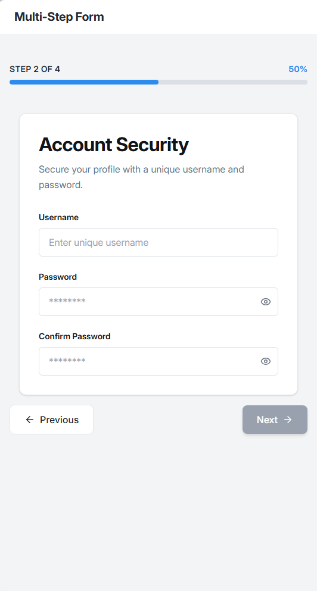
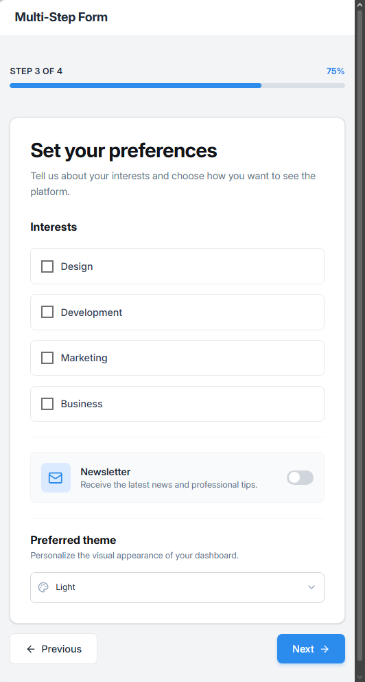
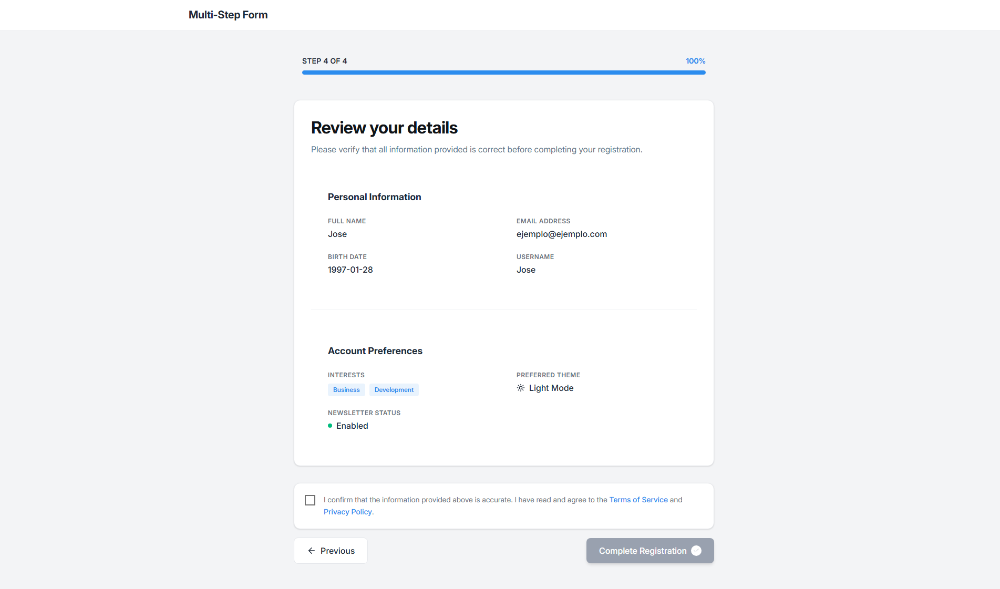

# 🚀 Multi-Step Registration Form

A modern, animated multi-step registration form built with React, TypeScript, and Tailwind CSS. Features smooth transitions, form validation, data persistence, and a delightful user experience.

    

## 📸 Screenshots

<div align="center">

| Step 1: Personal Info | Step 2: Account Security |
|:---------------------:|:------------------------:|
|  |  |

| Step 3: Preferences | Step 4: Summary |
|:-------------------:|:---------------:|
|  |  |

| Confirmation Modal | Success Screen |
|:------------------:|:--------------:|
|  |  |

</div>

## ✨ Features

- **4-Step Registration Flow** - Personal info, account security, preferences, and summary
- **Real-time Validation** - Instant feedback with field-level error messages
- **Smooth Animations** - Page transitions powered by Framer Motion
- **Data Persistence** - Form data saved to localStorage (survives page refresh)
- **Accessible** - ARIA attributes, keyboard navigation, focus management
- **Responsive Design** - Works seamlessly on mobile, tablet, and desktop
- **Confirmation Modal** - Review before final submission
- **Confetti Celebration** - Delightful success animation 🎉

## 🛠️ Tech Stack

| Technology | Purpose |
|------------|---------|
| **React 19** | UI library with latest features |
| **TypeScript** | Type safety and better DX |
| **Tailwind CSS 4** | Utility-first styling |
| **Framer Motion** | Smooth animations and transitions |
| **Vite** | Lightning-fast development |
| **Lucide React** | Beautiful icons |
| **Canvas Confetti** | Success celebration effect |

## 📁 Project Structure

```
src/
├── animations/          # Framer Motion variants
│   ├── formStep.variants.ts
│   └── modal.variants.ts
├── components/
│   ├── steps/           # Step components
│   │   ├── Step1Personal.tsx
│   │   ├── Step2Professional.tsx
│   │   ├── Step3Preferences.tsx
│   │   ├── Step4Summary.tsx
│   │   └── SuccessScreen.tsx
│   ├── ui/              # Reusable UI components
│   │   ├── FormInput.tsx
│   │   ├── PasswordInput.tsx
│   │   ├── ToggleSwitch.tsx
│   │   ├── ThemeSelect.tsx
│   │   ├── InterestCheckbox.tsx
│   │   └── ConfirmModal.tsx
│   ├── FormNavigation.tsx
│   ├── ProgressBar.tsx
│   ├── Layout.tsx
│   └── MultiStepForm.tsx
├── constants/           # Configuration
│   ├── formFields.ts
│   ├── formSteps.ts
│   ├── interests.ts
│   └── storageKeys.ts
├── hooks/               # Custom React hooks
│   ├── useFormNavigation.ts
│   ├── useFormSubmit.ts
│   ├── useMultiStepForm.ts
│   └── useTouched.ts
├── types/               # TypeScript definitions
│   ├── form.types.ts
│   └── step.types.ts
└── utils/               # Helper functions
    ├── styles.ts
    └── validation.ts
```

## 🚀 Quick Start

```bash
npm install && npm run dev
```

Open [http://localhost:5173](http://localhost:5173) in your browser.

## 🎨 Key Implementation Details

### Custom Hooks

```typescript
// Form state management with localStorage persistence
const { formData, updateFormData } = useMultiStepForm();

// Navigation with validation
const { currentStep, handleNextStep, handlePreviousStep } = useFormNavigation({ data: formData });

// Track touched fields for validation
const { touched, handleBlur } = useTouched();

// Modal and completion state
const { isModalOpen, isCompleted, openModal, confirmSubmit } = useFormSubmit();
```

### Validation

Real-time validation with detailed error messages:

```typescript
export const getFieldError = (field: keyof FormDataType, value: any): string | null => {
    switch (field) {
        case 'email':
            return !isValidEmail(value) ? 'Please enter a valid email' : null;
        case 'password':
            if (!isStrongPassword(value)) {
                return 'Password must contain uppercase, lowercase, and number';
            }
            return null;
        // ...
    }
};
```

### Animations

Smooth step transitions with Framer Motion:

```typescript
export const stepVariants: Variants = {
    enter: (direction: number) => ({
        x: direction > 0 ? 100 : -100,
        opacity: 0
    }),
    center: { x: 0, opacity: 1 },
    exit: (direction: number) => ({
        x: direction > 0 ? -100 : 100,
        opacity: 0
    })
};
```

## 📱 Responsive Design

- **Mobile**: Single column layout, stacked buttons
- **Tablet**: Optimized spacing and touch targets
- **Desktop**: Two-column grids where appropriate

## ♿ Accessibility

- Semantic HTML (`<header>`, `<section>`, `<label>`)
- ARIA attributes for modals and dynamic content
- Keyboard navigation (Escape to close modal)
- Focus management
- Color contrast compliance

## 👤 Author

**Jose Manuel Gijón**

- GitHub: [@josegijon](https://github.com/josegijon)
- LinkedIn: [Jose Manuel Gijón Almazán](https://www.linkedin.com/in/jose-manuel-gijón-almazán-bb804124b)
